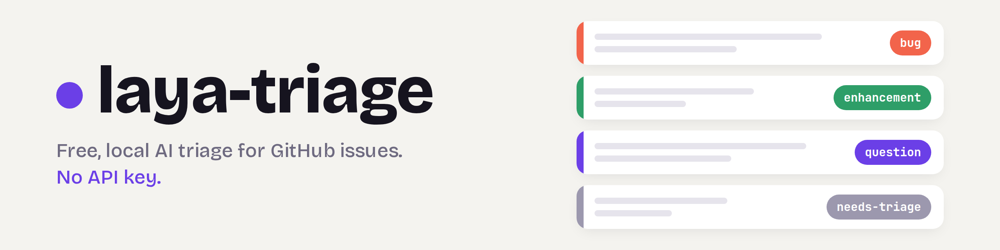
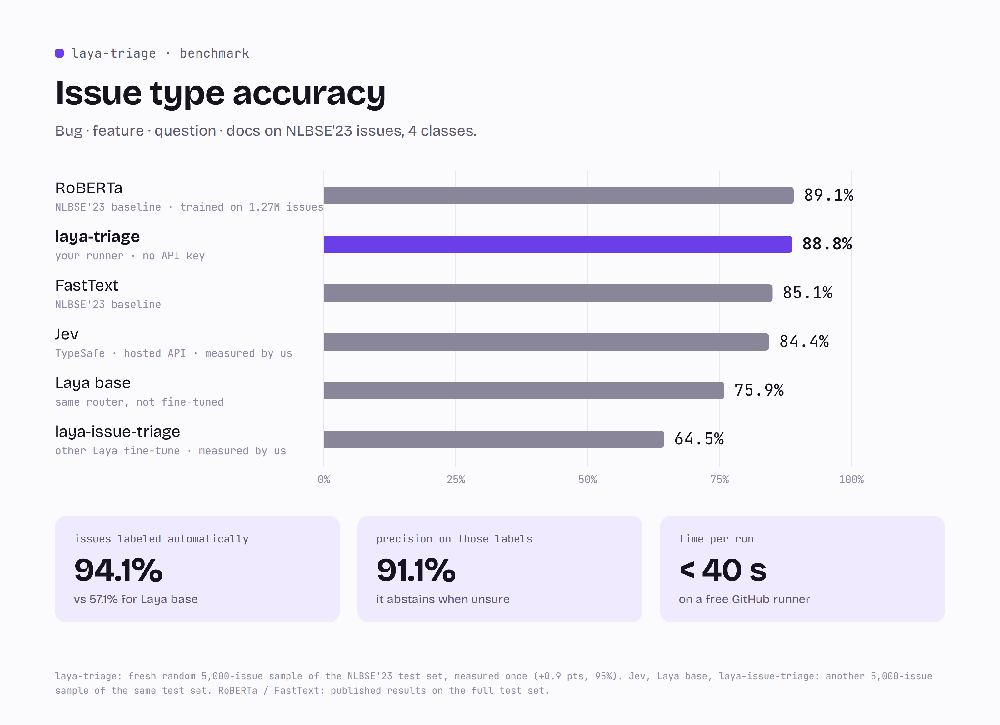
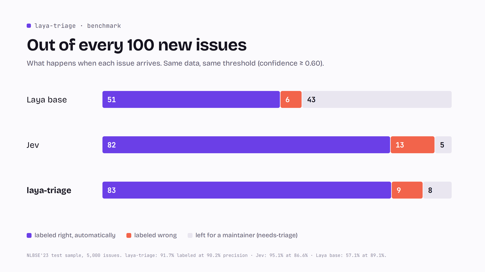
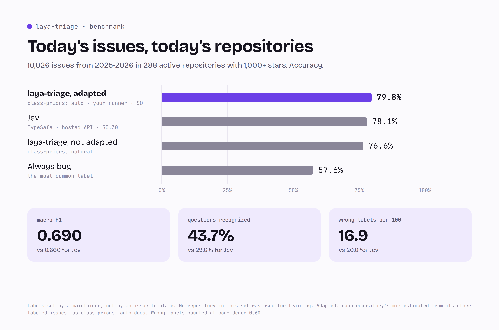
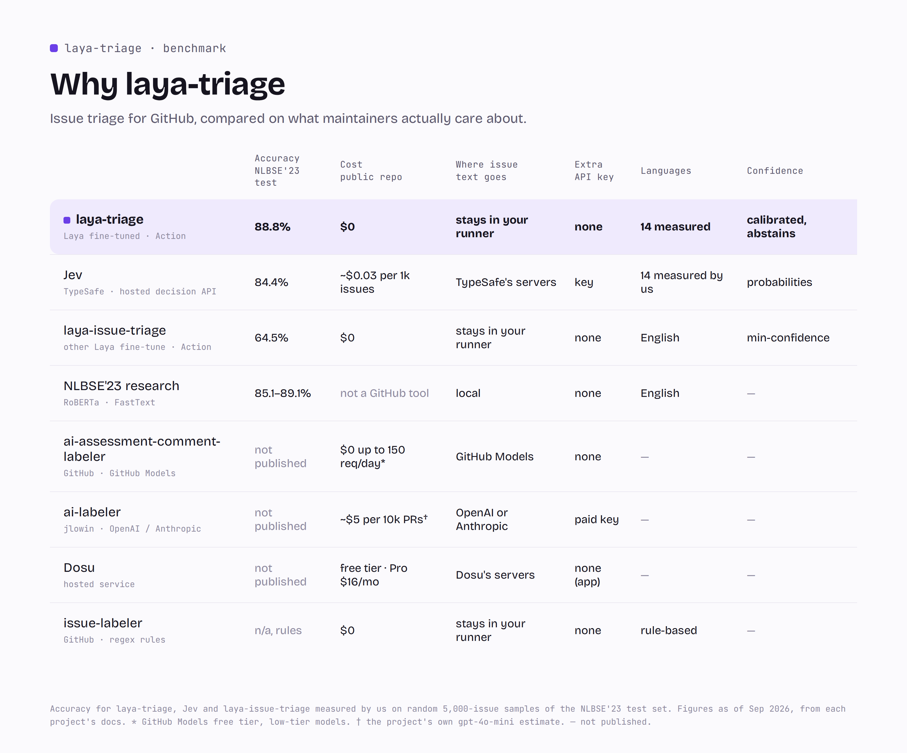
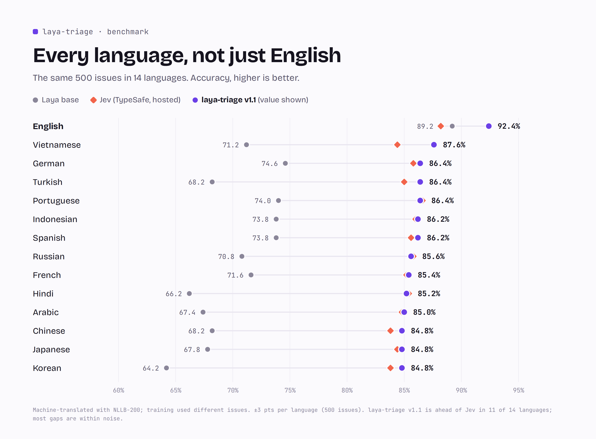
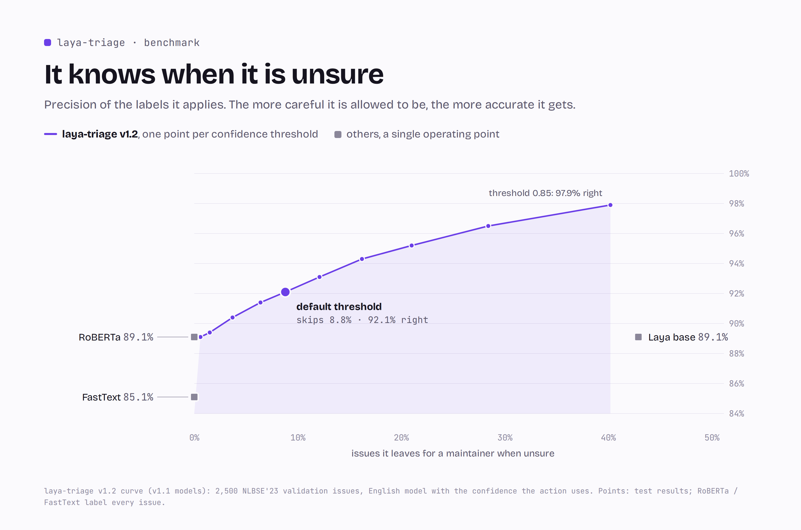
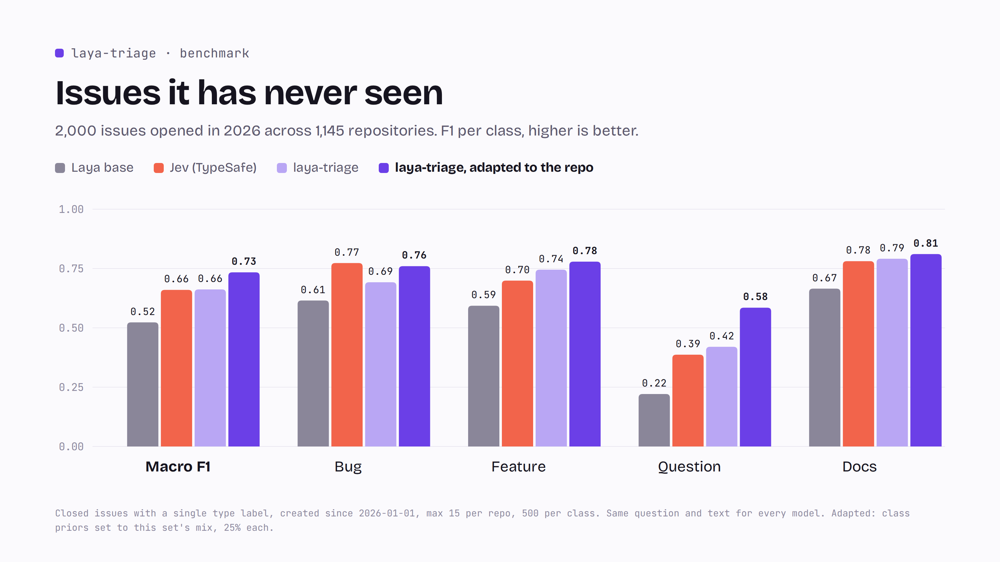
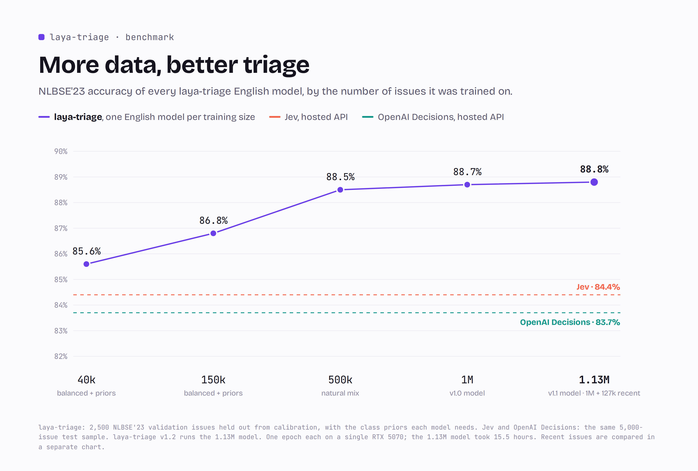

<p align="center">
  <picture>
    <source media="(prefers-color-scheme: dark)" srcset="docs/banner-dark.png">
    
  </picture>
</p>

<p align="center">
  <a href="https://github.com/elnachto/laya-triage/tags"></a>
  
  
  
  <a href="https://huggingface.co/elnachto/laya-triage-en"></a>
</p>


https://github.com/user-attachments/assets/a929519a-85ff-467b-9dc3-f49538046d64


Free, local AI triage for GitHub issues.

laya-triage is a GitHub Action that reads every new issue in your repository, labels it as a bug, feature request, question, or documentation problem, and asks for missing details. It runs a fine-tuned [Laya](https://github.com/NandhaKishorM/laya) model inside your GitHub Actions runner with no API key, no external service, and without sending issue text outside GitHub.

<p align="center">
  <picture>
    <source media="(prefers-color-scheme: dark)" srcset="docs/benchmarks/exactitud-dark.png">
    
  </picture>
</p>

## What it does

| Event | Decision | Result |
|---|---|---|
| New issue | Type: bug, feature, question or docs |     |
| New issue | Low confidence |  for a human to review |
| New bug report | Almost no real content once the template is removed |  and a comment asking for steps, version and expected behavior |
| New pull request | Trivial change that looks like spam (experimental, off by default) |  and a polite comment |

laya-triage never closes issues or pull requests. Maintainers keep full control over decisions.

## Quick start

Create `.github/workflows/triage.yml` in your repository:

```yaml
name: Triage

on:
  issues:
    types: [opened]

permissions:
  contents: read
  issues: write

jobs:
  triage:
    runs-on: ubuntu-latest
    steps:
      - uses: elnachto/laya-triage@v1
```

The process starts in **dry-run mode**, showing its decisions in the workflow log without making changes. Open some issues and look at the logs. Once you're confident with the results, switch it on:

```yaml
      - uses: elnachto/laya-triage@v1
        with:
          dry-run: "false"
```

## Recommended: warm the model cache

The two models weigh about 1.5 GB. GitHub only lets trusted events like `schedule` and `workflow_dispatch` write to the cache. Issue runs can read it but not save it. Add this second workflow and run it once from the Actions tab:

```yaml
name: Warm Laya cache

on:
  workflow_dispatch:
  schedule:
    - cron: "17 6 * * 1,4"

permissions:
  contents: read

jobs:
  warm:
    runs-on: ubuntu-latest
    steps:
      - uses: elnachto/laya-triage@v1
        with:
          mode: warm-cache
```

GitHub removes caches that haven't been used for seven days, so the schedule runs twice a week to keep the cache alive. Additionally, GitHub suspends any scheduled workflows after 60 days of inactivity in the repository; in that case, re-enable the workflow from the Actions tab.

On a typical runner, a triage run takes 30 to 40 seconds with a warm cache.

## How it compares

<p align="center">
  <picture>
    <source media="(prefers-color-scheme: dark)" srcset="docs/benchmarks/cien-issues-dark.png">
    
  </picture>
</p>

laya-triage only labels an issue when confident. It labels 94.1% of issues automatically, gets 91.1% of those right, and sends the rest to `needs-triage`. This results in fewer wrong labels than Jev (8 versus 13 per 100 issues).

<p align="center">
  <picture>
    <source media="(prefers-color-scheme: dark)" srcset="docs/benchmarks/repos-actuales-dark.png">
    
  </picture>
</p>

Issues written today are harder than any benchmark, so we also measured recent issues from active repositories that were never used for training. On its own, the model trails Jev there. Once it adapts to each repository's mix of bugs, features and questions, which the action does by default, it moves ahead: 79.8% against 78.1%, and it recognizes far more questions (43.7% against 29.6%).

<p align="center">
  <picture>
    <source media="(prefers-color-scheme: dark)" srcset="docs/benchmarks/comparativa-dark.png">
    
  </picture>
</p>

Hosted triage costs money every month, and someone must keep paying for it. The original Issue-Label-Bot was archived in 2022 due to its infrastructure costs. laya-triage runs on the free minutes GitHub gives public repositories, so there is no service to shut down.

<p align="center">
  <picture>
    <source media="(prefers-color-scheme: dark)" srcset="docs/benchmarks/idiomas-dark.png">
    
  </picture>
</p>

Issues in other languages go to a multilingual model. It matches a hosted API across 14 languages. On real non-English issues from 2026, it is well ahead of the base model (61.0% versus 47.1%).

<p align="center">
  <picture>
    <source media="(prefers-color-scheme: dark)" srcset="docs/benchmarks/confianza-dark.png">
    
  </picture>
</p>

The confidence is calibrated. When laya-triage says 90%, it is right about 90% of the time. A stricter threshold labels fewer issues with higher precision, reaching about 98% on half of them.

## Inputs

| Input | Default | Description |
|---|---|---|
| `dry-run` | `"true"` | Set to `"false"` to apply labels and comments |
| `mode` | `"triage"` | Use `"warm-cache"` to download the models and save them in the cache |
| `github-token` | `github.token` | Token used to add labels and comments |
| `spam-check` | `"false"` | Experimental. Set to `"true"` to check new pull requests for low-effort spam |
| `class-priors` | `"auto"` | How common each issue type is in your repository. `"auto"` counts your already labeled issues, `"natural"` uses the typical GitHub mix, or pass your own, like `"bug=0.5,feature=0.3,question=0.15,docs=0.05"` |
| `labels` | `"auto"` | `"auto"` reuses your existing type labels (such as `type: bug` or `kind/feature`) instead of creating new ones. You can also map them yourself: `"bug=type: bug,feature=feature request"` |

To try the spam check, also listen to pull requests and give the workflow write access to them:

```yaml
on:
  issues:
    types: [opened]
  pull_request_target:
    types: [opened]

permissions:
  contents: read
  issues: write
  pull-requests: write

jobs:
  triage:
    runs-on: ubuntu-latest
    steps:
      - uses: elnachto/laya-triage@v1
        with:
          spam-check: "true"
```

## Optional: a bot with its own name

Labels and comments show up as `github-actions` by default. To use your own bot name instead:

1. Create a GitHub App with **Issues** and **Pull requests** set to *Read and write*, and the webhook disabled.
2. Install it on your repository.
3. Save its client ID as the variable `LAYA_APP_CLIENT_ID` and its private key as the secret `LAYA_APP_PRIVATE_KEY`.
4. Generate a token and pass it to the action:

```yaml
    steps:
      - uses: actions/create-github-app-token@v3
        id: app-token
        with:
          client-id: ${{ vars.LAYA_APP_CLIENT_ID }}
          private-key: ${{ secrets.LAYA_APP_PRIVATE_KEY }}

      - uses: elnachto/laya-triage@v1
        with:
          dry-run: "false"
          github-token: ${{ steps.app-token.outputs.token }}
```

With a GitHub App token, the workflow only needs `contents: read`.

## How it runs

1. The action restores a Python environment and the two models from the GitHub cache.
2. It removes your repository's issue template boilerplate, so only what the author actually wrote is classified.
3. The Laya router sends English issues to [laya-triage-en](https://huggingface.co/elnachto/laya-triage-en) and other languages to [laya-triage-multilingual](https://huggingface.co/elnachto/laya-triage-multilingual). Both are downloaded at a fixed revision, so `@v1` always uses the exact models that were measured.
4. The model answers in a single forward pass on the runner's CPU. The English model was trained on the real mix of GitHub issues. The multilingual model was trained on balanced classes, so its answer is adjusted with class priors, because real repositories get far more bugs and feature requests than questions.
5. The answer is adjusted to your repository: the action counts how many of your labeled issues are bugs, feature requests, questions and docs, so a repository full of questions gets more `question` labels.
6. If the confidence is at least 0.60, the label is applied, using your own label names when you already have them. Otherwise the issue gets `needs-triage`.

## Security

- The action never checks out pull request code. It only reads the title, description, and change stats from the event, which keeps `pull_request_target` safe with pull requests from forks.
- Issue and pull request text never reaches a shell. Python reads it from the event file, which prevents script injection.
- Only trusted events write to the model cache, as explained above, which protects against cache poisoning.
- Models are pinned to an exact commit on Hugging Face, so a new upload cannot change what an existing version of the action runs.

## Limitations

- **question** and **docs** are the hardest classes (F1 around 0.6 to 0.7). Many questions read like bug reports, and questions are rare in real repositories, so the model is cautious about predicting them. Repositories that receive mostly questions will see some of them labeled as bugs.
- The best published result on this benchmark is the NLBSE'23 RoBERTa baseline (89.1%), trained on about 1.27M issues. laya-triage is 0.3 points behind, within the margin of error, while running on a free CPU runner.
- Issues written today are harder than the NLBSE'23 test set. Without adapting to the repository, laya-triage and Jev are level on issues from 2026 and Jev is ahead on recent issues from active repositories; adapting to each repository puts laya-triage ahead on both.
- `class-priors: auto` needs at least 30 labeled issues and counts every labeled issue, including the ones laya-triage labeled itself. If most of your labels come from the action, set the mix by hand.
- The multilingual model was trained on machine-translated issues. It is measured on 14 languages; other languages work through the base model but aren’t evaluated.
- The spam check is experimental: on our pull request data it catches only a small share of spam, which is why it is off by default.
- Bug reports with less than 30 characters of real content get `needs-more-info`. Very short but complete reports may also get this label.

## How it was measured

The headline number comes from a fresh random sample of 5,000 issues from the official [NLBSE'23](https://github.com/nlbse2023/issue-report-classification) test set. It was used once, after every decision was frozen on a separate validation split. Jev, Laya base and laya-issue-triage were run by us, with the same question, on an earlier 5,000-issue sample of the same test set. The previous laya-triage model scored 86.8% there and 87.2% on the fresh sample, so the two samples agree. The ±0.9 point margin is the 95% interval for 5,000 issues.

To check that the models are not tuned to an old dataset, we also collected 2,000 closed issues opened in 2026 across 1,145 repositories, 500 per class. Without adapting, laya-triage and Jev are level (macro F1 0.662 and 0.660). The set is balanced on purpose, so it weighs questions four times more than a typical repository does; with class priors set to that mix, laya-triage reaches 0.734:

<p align="center">
  <picture>
    <source media="(prefers-color-scheme: dark)" srcset="docs/benchmarks/issues-2026-dark.png">
    
  </picture>
</p>

<p align="center">
  <picture>
    <source media="(prefers-color-scheme: dark)" srcset="docs/benchmarks/curva-dark.png">
    
  </picture>
</p>

The recent-issues benchmark has 10,026 closed issues opened in 2025 and 2026 in 288 repositories with at least 1,000 stars and recent activity. We kept only issues with a single type label that a maintainer applied, not the author or an issue template, and no repository in it was used for training. To simulate `class-priors: auto`, each issue's repository mix was estimated from the other labeled issues of the same repository, never from the issue itself. Jev cost $0.30 for this run.

The scripts behind every number are in [`bench/`](bench) and [`entrenamiento/`](entrenamiento), and the raw results are in [`bench/resultados/`](bench/resultados). A longer write-up is in [docs/comparison.md](docs/comparison.md).

## Run it locally

```bash
python -m venv .venv
.venv/bin/python -m pip install -r requirements.txt
.venv/bin/python triage.py tests/eventos/issue_vago.json
```

The first run downloads the two models (about 1.5 GB). Local runs never change anything on GitHub unless you set `LAYA_DRY_RUN=false` and a `GITHUB_TOKEN`.

## Credits

Built on [Laya](https://github.com/NandhaKishorM/laya) by Convai Innovations (Apache 2.0). Training and test data from the [NLBSE'23 tool competition](https://github.com/nlbse2023/issue-report-classification). Translations with [NLLB-200](https://huggingface.co/facebook/nllb-200-distilled-600M).

## License

Apache 2.0. See [LICENSE](LICENSE).