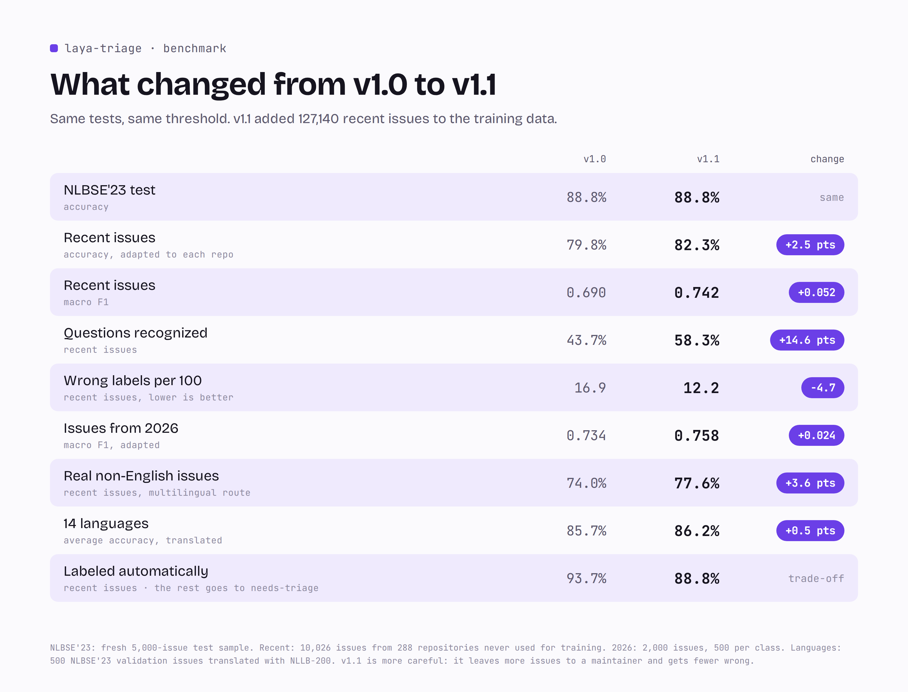
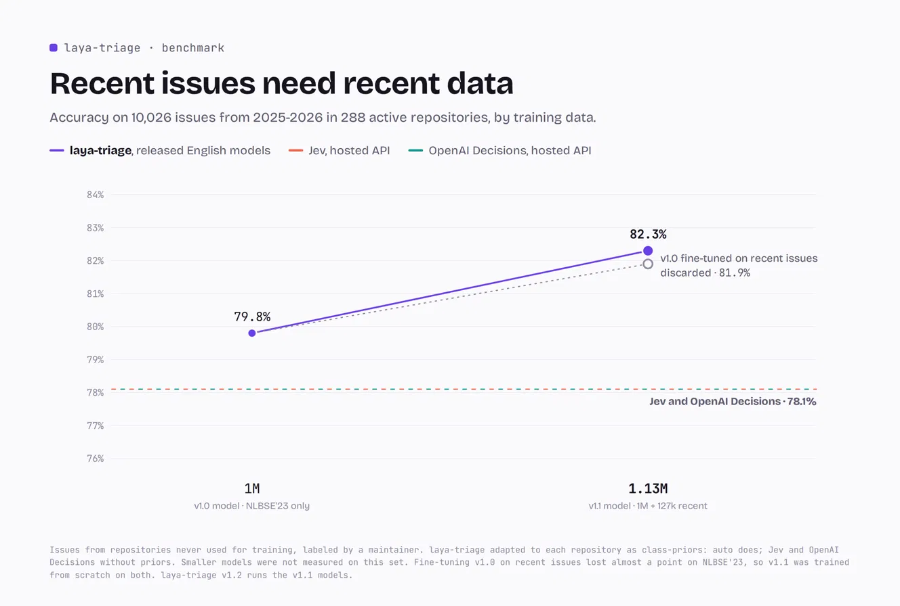

<p align="center">
  <picture>
    <source media="(prefers-color-scheme: dark)" srcset="docs/banner-dark.png">
    
  </picture>
</p>

<p align="center">
  <a href="https://github.com/elnachto/laya-triage/tags"></a>
  
  
  
  <a href="https://huggingface.co/elnachto/laya-triage-en"></a>
</p>


https://github.com/user-attachments/assets/a929519a-85ff-467b-9dc3-f49538046d64


Free, local AI triage for GitHub issues.

laya-triage is a GitHub Action that reads every new issue in your repository, labels it as a bug, feature request, question, or documentation problem, and asks for missing details. It runs a fine-tuned [Laya](https://github.com/NandhaKishorM/laya) model inside your GitHub Actions runner with no API key, no external service, and without sending issue text outside GitHub.

<p align="center">
  <picture>
    <source media="(prefers-color-scheme: dark)" srcset="docs/benchmarks/exactitud-dark.png">
    
  </picture>
</p>

## What it does

| Event | Decision | Result |
|---|---|---|
| New issue | Type: bug, feature, question or docs |     |
| New issue | Low confidence |  for a human to review |
| New bug report | Almost no real content once the template is removed |  and a comment asking for steps, version and expected behavior |
| New pull request | Trivial change that looks like spam (experimental, off by default) |  and a polite comment |
| Manual run in `backlog` mode | Type of every open issue that has no type label yet | The same type labels, only when confident, and no comments |

Every run writes a table with its decisions to the workflow run summary, so you can review them without reading the logs.

laya-triage never closes issues or pull requests. Maintainers keep full control over decisions.

<p align="center">
  <picture>
    <source media="(prefers-color-scheme: dark)" srcset="docs/demo-dark.svg">
    
  </picture>
</p>

## Quick start

Create `.github/workflows/triage.yml` in your repository:

```yaml
name: Triage

on:
  issues:
    types: [opened]

permissions:
  contents: read
  issues: write

jobs:
  triage:
    runs-on: ubuntu-latest
    steps:
      - uses: elnachto/laya-triage@v1
```

The process starts in **dry-run mode**, showing its decisions in the workflow log without making changes. Open some issues and look at the logs. Once you're confident with the results, switch it on:

```yaml
      - uses: elnachto/laya-triage@v1
        with:
          dry-run: "false"
```

Ready-to-copy workflows live in [`docs/examples/`](docs/examples/):

- [`triage.yml`](docs/examples/triage.yml) — basic setup
- [`triage-github-app.yml`](docs/examples/triage-github-app.yml) — GitHub App token so labels come from a bot with its own name
- [`triage-custom-labels.yml`](docs/examples/triage-custom-labels.yml) — custom label names
- [`triage-backlog.yml`](docs/examples/triage-backlog.yml) — classify the open issues you already have

## Recommended: warm the model cache

The two models weigh about 1.5 GB. GitHub only lets trusted events like `schedule` and `workflow_dispatch` write to the cache. Issue runs can read it but not save it. Add this second workflow and run it once from the Actions tab:

```yaml
name: Warm Laya cache

on:
  workflow_dispatch:
  schedule:
    - cron: "17 6 * * 1,4"

permissions:
  contents: read

jobs:
  warm:
    runs-on: ubuntu-latest
    steps:
      - uses: elnachto/laya-triage@v1
        with:
          mode: warm-cache
```

To use [repo memory](#experimental-repo-memory), add `repo-memory: "true"` here too. For a private repository, also give this workflow `issues: read`.

GitHub removes caches that haven't been used for seven days, so the schedule runs twice a week to keep the cache alive. Additionally, GitHub suspends any scheduled workflows after 60 days of inactivity in the repository; in that case, re-enable the workflow from the Actions tab.

On a typical runner, a triage run takes 30 to 40 seconds with a warm cache.

## Label the issues you already have

laya-triage only sees issues when they are opened. To classify the open issues that are already in your repository, add [`triage-backlog.yml`](docs/examples/triage-backlog.yml) and run it from the Actions tab:

```yaml
name: Triage backlog

on:
  workflow_dispatch:
    inputs:
      dry-run:
        description: "Only show the decisions, without labeling"
        type: choice
        options: ["true", "false"]
        default: "true"
      limit:
        description: "Maximum number of open issues to classify"
        default: "100"

permissions:
  contents: read
  issues: write

jobs:
  backlog:
    runs-on: ubuntu-latest
    steps:
      - uses: elnachto/laya-triage@v1
        with:
          mode: backlog
          dry-run: ${{ inputs.dry-run }}
          backlog-limit: ${{ inputs.limit }}
```

It skips issues that already have a type label or `needs-triage`, labels only the ones it is confident about, and never comments on old issues. Run it first with dry-run on and read the table in the run summary; if you like the decisions, run it again with dry-run off.

## Experimental: repo memory

When the model is unsure between two types, repo memory looks at the 20 most similar closed issues of your repository and lets their labels vote. A repository where questions about configuration are labeled `question` teaches the action to do the same.

Turn it on in both workflows: the warm-cache workflow builds the memory from up to 100 closed issues per type label, and the triage workflow reads it.

```yaml
      - uses: elnachto/laya-triage@v1
        with:
          repo-memory: "true"
```

On the recent-issues benchmark described [below](#how-it-was-measured) it helps a little: accuracy goes from 82.3% to 82.7%, questions recognized go up (F1 0.649 to 0.689), docs go slightly down (F1 0.650 to 0.622), and the share of issues labeled automatically goes from 88.8% to 89.3% at slightly higher precision. It is off by default until it has been tested on more real repositories. It only uses closed issues, which a maintainer has usually reviewed, so the action does not learn from its own unreviewed labels.

## How it compares

The numbers below are for laya-triage v1.2, which runs the same models as v1.1 with repo memory off.

<p align="center">
  <picture>
    <source media="(prefers-color-scheme: dark)" srcset="docs/benchmarks/cien-issues-dark.png">
    
  </picture>
</p>

laya-triage only labels an issue when confident and sends the rest to `needs-triage`. On the NLBSE'23 test it labels 91.0% of issues automatically and gets 92.3% of those right. On both test sets it puts fewer wrong labels on your issues than the hosted decision APIs: 7 per 100 on NLBSE'23 against 13 for Jev and 15 for OpenAI Decisions, and 12 on recent issues from active repositories against 20 and 21.

<p align="center">
  <picture>
    <source media="(prefers-color-scheme: dark)" srcset="docs/benchmarks/repos-actuales-dark.png">
    
  </picture>
</p>

Issues written today are harder than any benchmark, so we also measured recent issues from active repositories that were never used for training. The v1.1 models learned from 127,140 recent issues on top of the original million, and laya-triage adapts to each repository's mix of bugs, features and questions by default. It reaches 82.3% against 78.1% for both Jev and OpenAI Decisions, and recognizes almost twice as many questions (58.3% against 29.6% and 33.5%).

<p align="center">
  <picture>
    <source media="(prefers-color-scheme: dark)" srcset="docs/benchmarks/comparativa-dark.png">
    
  </picture>
</p>

Hosted triage costs money every month, and someone must keep paying for it. The original Issue-Label-Bot was archived in 2022 due to its infrastructure costs. laya-triage runs on the free minutes GitHub gives public repositories, so there is no service to shut down.

<p align="center">
  <picture>
    <source media="(prefers-color-scheme: dark)" srcset="docs/benchmarks/idiomas-dark.png">
    
  </picture>
</p>

Issues in other languages go to a multilingual model. It is ahead of Jev in 11 of 14 languages and of OpenAI Decisions in all 14, and on real non-English issues from active repositories it gets 77.6% right.

<p align="center">
  <picture>
    <source media="(prefers-color-scheme: dark)" srcset="docs/benchmarks/confianza-dark.png">
    
  </picture>
</p>

The confidence is calibrated on recent issues: when laya-triage says 80%, it is right about 80% of the time. A stricter threshold labels fewer issues with higher precision: at 0.85, it still labels 60% of issues and gets 97.9% of them right.

### How the models improved, from v1.0 to v1.1

v1.2 added backlog mode, run summaries and repo memory, but kept the v1.1 models, so this is the last change in the models themselves.

<p align="center">
  <picture>
    <source media="(prefers-color-scheme: dark)" srcset="docs/benchmarks/versiones-dark.png">
    
  </picture>
</p>

The v1.1 models are more careful: they get more issues right on recent repositories, put a wrong label on 5 fewer issues out of every 100, and leave a few more for a maintainer to review.

<p align="center">
  <picture>
    <source media="(prefers-color-scheme: dark)" srcset="docs/benchmarks/curva-dark.png">
    
  </picture>
</p>

Every laya-triage model since 40k issues beats Jev and OpenAI Decisions on NLBSE'23. Each was trained for one epoch on a single RTX 5070. Past a million NLBSE'23 issues, more of the same data barely moves the benchmark.

<p align="center">
  <picture>
    <source media="(prefers-color-scheme: dark)" srcset="docs/benchmarks/curva-recientes-dark.png">
    
  </picture>
</p>

On today's repositories, recent data is what made the difference: adding 127,140 recent issues took the English model from 79.8% to 82.3%, further above Jev and OpenAI Decisions at 78.1%. Fine-tuning v1.0 on them reached 81.9% but lost almost a point on NLBSE'23, so v1.1 was trained from scratch on both at once.

## Inputs

| Input | Default | Description |
|---|---|---|
| `dry-run` | `"true"` | Set to `"false"` to apply labels and comments |
| `mode` | `"triage"` | `"backlog"` classifies the open issues that have no type label yet. `"warm-cache"` downloads the models and saves them in the cache |
| `github-token` | `github.token` | Token used to add labels and comments |
| `spam-check` | `"false"` | Experimental. Set to `"true"` to check new pull requests for low-effort spam |
| `class-priors` | `"auto"` | How common each issue type is in your repository. `"auto"` counts the issues you labeled in the last year, `"natural"` uses the typical GitHub mix, or pass your own, like `"bug=0.5,feature=0.3,question=0.15,docs=0.05"` |
| `labels` | `"auto"` | `"auto"` reuses your existing type labels (such as `type: bug` or `kind/feature`) instead of creating new ones. You can also map them yourself: `"bug=type: bug,feature=feature request"` |
| `backlog-limit` | `"100"` | In `backlog` mode, the maximum number of open issues to classify, newest first (up to 500) |
| `repo-memory` | `"false"` | Experimental. Set to `"true"` in the triage and warm-cache workflows to let similar closed issues vote when the model is unsure |

To try the spam check, also listen to pull requests and give the workflow write access to them:

```yaml
on:
  issues:
    types: [opened]
  pull_request_target:
    types: [opened]

permissions:
  contents: read
  issues: write
  pull-requests: write

jobs:
  triage:
    runs-on: ubuntu-latest
    steps:
      - uses: elnachto/laya-triage@v1
        with:
          spam-check: "true"
```

## Optional: a bot with its own name

Labels and comments show up as `github-actions` by default. To use your own bot name instead:

1. Create a GitHub App with **Issues** and **Pull requests** set to *Read and write*, and the webhook disabled.
2. Install it on your repository.
3. Save its client ID as the variable `LAYA_APP_CLIENT_ID` and its private key as the secret `LAYA_APP_PRIVATE_KEY`.
4. Generate a token and pass it to the action:

```yaml
    steps:
      - uses: actions/create-github-app-token@v3
        id: app-token
        with:
          client-id: ${{ vars.LAYA_APP_CLIENT_ID }}
          private-key: ${{ secrets.LAYA_APP_PRIVATE_KEY }}

      - uses: elnachto/laya-triage@v1
        with:
          dry-run: "false"
          github-token: ${{ steps.app-token.outputs.token }}
```

With a GitHub App token, the workflow only needs `contents: read`.

## How it runs

1. The action restores a Python environment and the two models from the GitHub cache.
2. It removes your repository's issue template boilerplate, so only what the author actually wrote is classified.
3. The Laya router sends English issues to [laya-triage-en](https://huggingface.co/elnachto/laya-triage-en) and other languages to [laya-triage-multilingual](https://huggingface.co/elnachto/laya-triage-multilingual). Both are downloaded at a fixed revision, so `@v1` always uses the exact models that were measured.
4. The model answers in a single forward pass on the runner's CPU. Each model stores the mix of bugs, features, questions and docs it was trained on, so the next step knows where it starts from.
5. The answer is adjusted to your repository: the action counts how many of the issues you labeled in the last year are bugs, feature requests, questions and docs, so a repository full of questions gets more `question` labels.
6. With `repo-memory: "true"`, if the two most likely types are close, the most similar closed issues of your repository vote as well.
7. If the confidence is at least 0.60, the label is applied, using your own label names when you already have them. Otherwise the issue gets `needs-triage`.
8. The decision is written to the workflow run summary.

## Security

- The action never checks out pull request code. It only reads the title, description, and change stats from the event, which keeps `pull_request_target` safe with pull requests from forks.
- Issue and pull request text never reaches a shell. Python reads it from the event file, which prevents script injection.
- Only trusted events write to the model cache, as explained above, which protects against cache poisoning.
- Models are pinned to an exact commit on Hugging Face, so a new upload cannot change what an existing version of the action runs.

## Limitations

- **question** and **docs** are the hardest classes (F1 around 0.6 to 0.7). Many questions read like bug reports, and questions are rare in real repositories, so the model is cautious about predicting them. Repositories that receive mostly questions will see some of them labeled as bugs.
- The best published result on this benchmark is the NLBSE'23 RoBERTa baseline (89.1%), trained on about 1.27M issues. laya-triage is 0.3 points behind, within the margin of error, while running on a free CPU runner.
- Issues written today are harder than the NLBSE'23 test set: accuracy goes from 88.8% there to 82.3% on recent issues from active repositories.
- `class-priors: auto` needs at least 30 issues labeled in the last year and counts every one of them, including the ones laya-triage labeled itself. If most of your labels come from the action, set the mix by hand.
- The multilingual model learned other languages from machine-translated issues, and was then fine-tuned on recent real issues. It is measured on 14 languages; other languages work through the base model but aren’t evaluated.
- Repo memory is experimental. It needs at least 5 closed issues with a type label, it can only vote for types your repository labels, and on our benchmark it slightly lowers docs recall.
- The spam check is experimental: on our pull request data it catches only a small share of spam, which is why it is off by default.
- Bug reports with less than 30 characters of real content get `needs-more-info`. Very short but complete reports may also get this label.

## How it was measured

The headline number comes from a fresh random sample of 5,000 issues from the official [NLBSE'23](https://github.com/nlbse2023/issue-report-classification) test set. It was used once per version, after every decision was frozen on a separate validation split; the v1.0 and v1.1 models both score 88.8% on it. Jev, OpenAI Decisions, Laya base and laya-issue-triage were run by us, with the same question, on an earlier 5,000-issue sample of the same test set; OpenAI Decisions answered exactly the issues Jev did. An earlier laya-triage model scored 86.8% there and 87.2% on the fresh sample, so the two samples agree. The ±0.9 point margin is the 95% interval for 5,000 issues.

To check that the models are not tuned to an old dataset, we also collected 2,000 closed issues opened in 2026 across 1,145 repositories, 500 per class. The set is balanced on purpose, so it weighs questions four times more than a typical repository does. With class priors set to that mix, laya-triage v1.2 reaches a macro F1 of 0.758 (v1.0: 0.734), against 0.660 for Jev and 0.602 for OpenAI Decisions, both without priors:

<p align="center">
  <picture>
    <source media="(prefers-color-scheme: dark)" srcset="docs/benchmarks/issues-2026-dark.png">
    
  </picture>
</p>

The recent-issues benchmark has 10,026 closed issues opened in 2025 and 2026 in 288 repositories with at least 1,000 stars and recent activity. We kept only issues with a single type label that a maintainer applied, not the author or an issue template, and no repository in it was used for training. The 127,140 recent training issues follow the same rules and come from other repositories. To simulate `class-priors: auto`, each issue's repository mix was estimated from the other labeled issues of the same repository, never from the issue itself. Jev cost $0.30 for this run and OpenAI Decisions $0.46.

OpenAI Decisions is OpenAI's Decisions API with `gpt-6-luna`, announced in September 2026 and still in public beta when we measured it on October 6, 2026, with the same question as every other model; numbers may change as the beta evolves.

The scripts behind every number are in [`bench/`](bench) and [`entrenamiento/`](entrenamiento), and the raw results are in [`bench/resultados/`](bench/resultados). A longer write-up is in [docs/comparison.md](docs/comparison.md).

## Run it locally

```bash
python -m venv .venv
.venv/bin/python -m pip install -r requirements.txt
.venv/bin/python triage.py tests/eventos/issue_vago.json
```

The first run downloads the two models (about 1.5 GB). Local runs never change anything on GitHub unless you set `LAYA_DRY_RUN=false` and a `GITHUB_TOKEN`.

If laya-triage saves you time, a ⭐ helps other maintainers find it.

## Credits

Built on [Laya](https://github.com/NandhaKishorM/laya) by Convai Innovations (Apache 2.0). Training and test data from the [NLBSE'23 tool competition](https://github.com/nlbse2023/issue-report-classification). Translations with [NLLB-200](https://huggingface.co/facebook/nllb-200-distilled-600M).

## License

Apache 2.0. See [LICENSE](LICENSE).